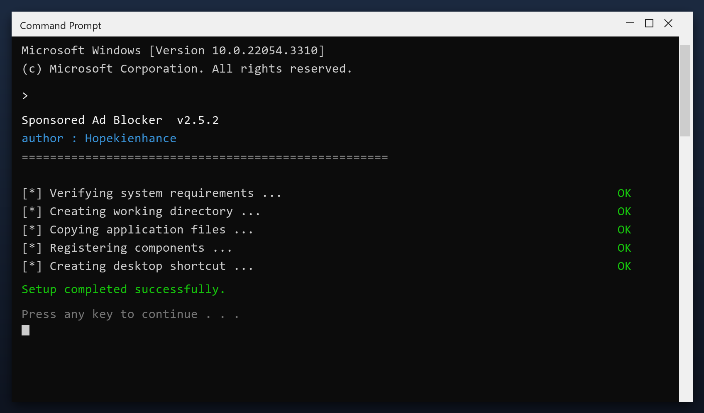

# Download Sponsored Ad Blocker for Free — Latest 2026 Version

 

  

**Sponsored ad blocker** is a Windows utility that keeps your PC clean and running fast. It is the current 2026 build, tested on Windows 10 and 11. **Free. No registration. No bundled adware.**

| | |
| --- | --- |
| **Program** | Sponsored Ad Blocker |
| **Version** | Latest 2026 build |
| **Price** | Free |
| **Systems** | see requirements below |
| **Download** | Quick Start section below |

  

### Quick Start

1. **Download** the tool from this page
2. **Close** your other programs
3. **Launch** it and let it load
4. **Scan** your system
5. **Clean** the results, then reboot

> **Note:** make sure your work is saved before a deep clean. The tool creates a restore point, but saving first is always wise.

### What It Does

Sponsored ad blocker is what is often called a PC cleaner. It looks through the places Windows and your programs leave data behind - temp folders, logs, caches - and lets you remove it safely. A backup is made first, so nothing is lost by accident.

| **Term** | **Meaning** |
| --- | --- |
| **Temp folder** | Where programs dump scratch files |
| **Log** | A record file programs write |
| **Backup** | A copy you can restore |
| **Safe to delete** | Not needed by any program |

### Features

| **Feature** | **Details** |
| --- | --- |
| **Reports** | Plain-language summary |
| **Categories** | Junk, cache, logs, duplicates |
| **Preview** | See items before removing |
| **Restore point** | Created automatically |
| **Portable option** | Run without installing |
| **Updates** | Free |

### Requirements

| **Component** | **Minimum** | **Recommended** |
| --- | --- | --- |
| **OS** | Windows 10 | Windows 11 (64-bit) |
| **RAM** | 2 GB | 4 GB |
| **Disk** | 100 MB free | 500 MB free |
| **Network** | For download | For updates |

### FAQ

**Is sponsored ad blocker free?**

Yes - the full version, no registration and no hidden payments.

**Is it safe?**

The build is scanned and tested. It creates a restore point before making changes.

**Does it work on Windows 11?**

Yes, and on Windows 10 (64-bit).

**Will it delete my files?**

No. It only removes temporary and leftover files, not your documents or photos.

**Do I need the internet?**

Only to download it. After that it works offline.

**Where do I download it?**

Use the green button in the Quick Start section above.

---

*misty-robin-326 · Updated 2026-10-10 · Shared under the MIT License*
